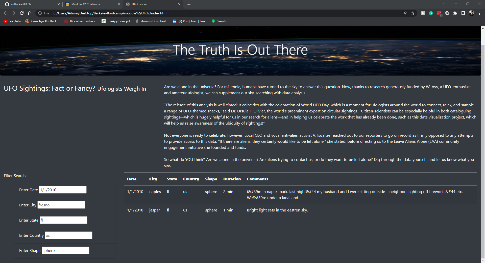

# UFOs - Module 12

## Overview
We were asked to make a webpage to display information on UFO sightings. We used Javascript and HTML to create the webpage.

## Results
We were able to make a webpage that displayed the UFO sighting data while allowing the user to filter based on date, city, state, country, and shape. Before the user uses any filter, the page displays all sightings in the dataset.

### No filter
In this first screenshot, we display the data as it is without any filtering.

### One filter
In this screenshot, we applied one filter to the data. We filtered for the sphere shape.

### Multiple filters
In this screenshot, we applied multiple filters to the data. We filtered for the date 1/1/2010, the state of fl, and the sphere shape.

## Summary
One of the main drawbacks of this page is that when the user puts in a filter, if anything is misspelt no results show.
One of the ways to improve this webpage would be by allowing the user to select multiple dates or a range of dates, as well as multiple different cities, states, etc. Another way would be to make the filters that take text accept results without being case sensitive.
